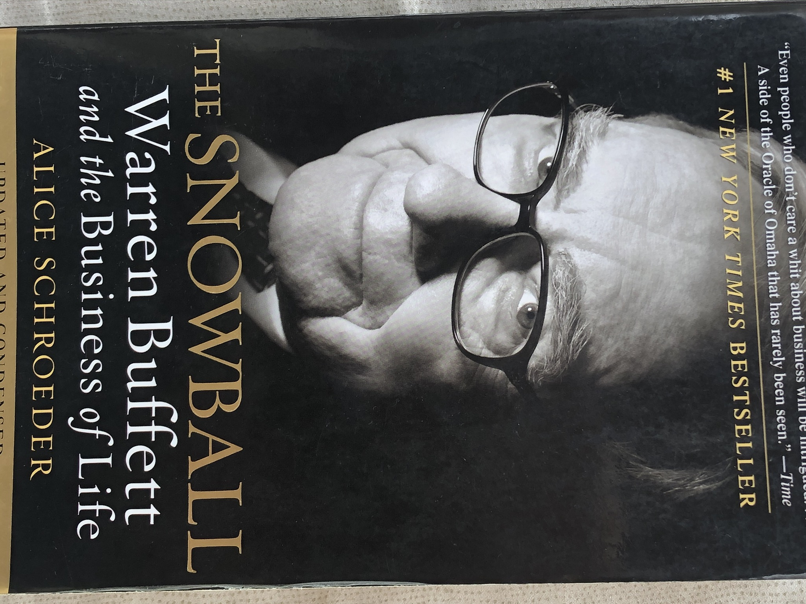
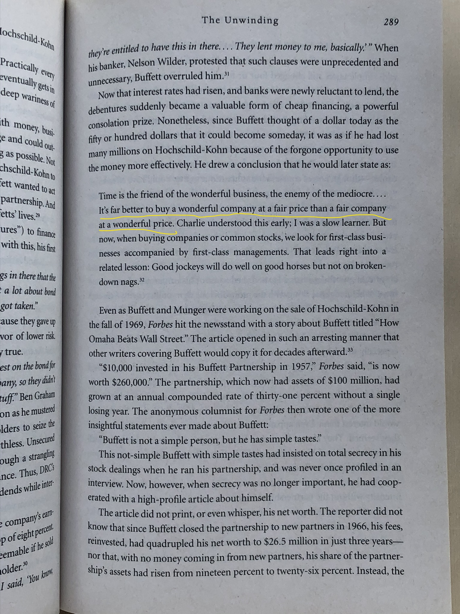
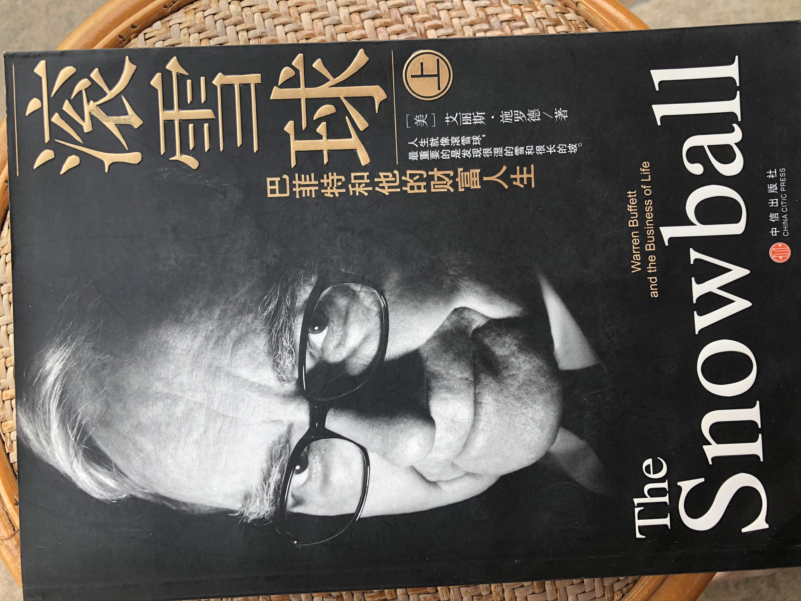
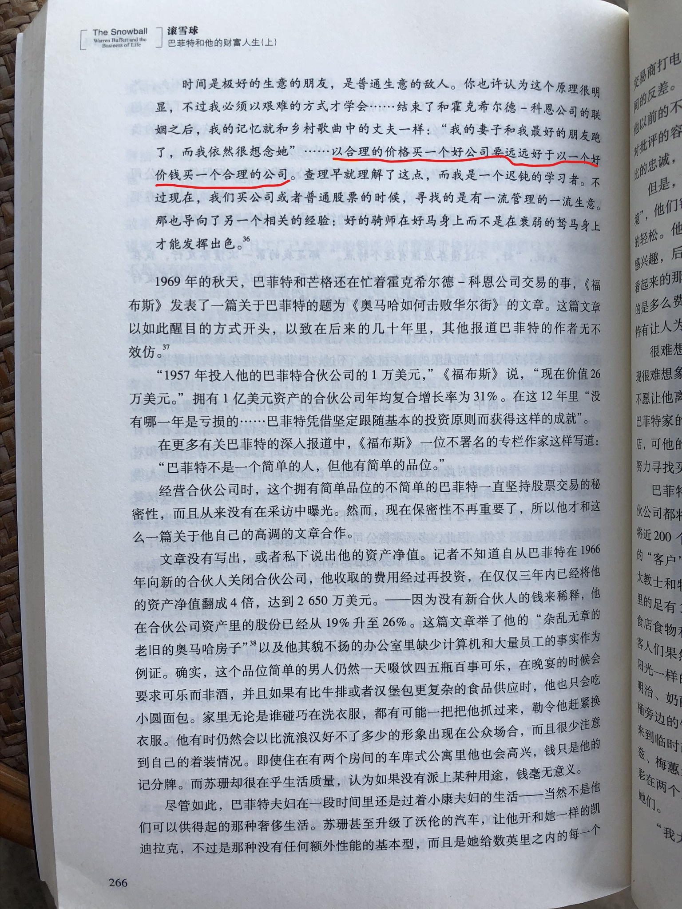

投资随想001 2020/7/9

It’s far better to buy a wonderful company at a fair price than a fair company at a wonderful price.
在ALICE SCHROEDER女士写的巴菲特传记中也引用了这句投资箴言，我觉得这句话非常有意思，很有道理。中信出版社的译本这段中文的翻译就远远没有那么传神了“以合理的价格买一个好公司要远远好于以一个好价钱买一个合理的公司”。经典的东西需要看原著。

在2020年COVID-19疫情期间，无论是非常棒的公司还是一般平庸的公司都出现了非常好的价格。
非常棒的公司亚马逊（AMZN）从前期高点2050.50美元下跌到1307美元
非常棒的公司特斯拉（TSLA）从前期高点968.99美元下跌到350.51美元
还算可以的公司美国航空（AAL）从前期高点56.99美元下跌到9.04美元

买那个的公司？这是一个问题

经过半年之后，我们看看
非常棒的公司亚马逊（AMZN）3081.11美元
非常棒的公司特斯拉（TSLA）1365.88美元
还算可以的公司美国航空（AAL）11.99美元

如果你买了亚马逊、特斯拉，那么你会心里非常踏实，睡眠非常好，这就是一个比较好的投资决策。
如果你买了美国航空，那么你心里就没有那么踏实，因为你要看看它什么时候涨上来再卖掉它，这就是一个比较闹心的投资决策。

之所以要买一个比较棒的公司，是基于这样的一种理念，我们持有公司的股票是我们的资产存在的一种形式，也就是我们资产总是以股票、现金、债券的方式存在。

我们就一直拿着非常棒的公司，我们认为他有好的未来，我们不需要考虑何时卖掉它，因为我们认为它比现金还好。只有两个情况我们才要卖掉它，一是我们用钱消费，二是发现更棒的公司。

基于对市场的敬畏，我们不能预测价格，只能等待fair的价格出现再下手，没有好的价格就一直等。

